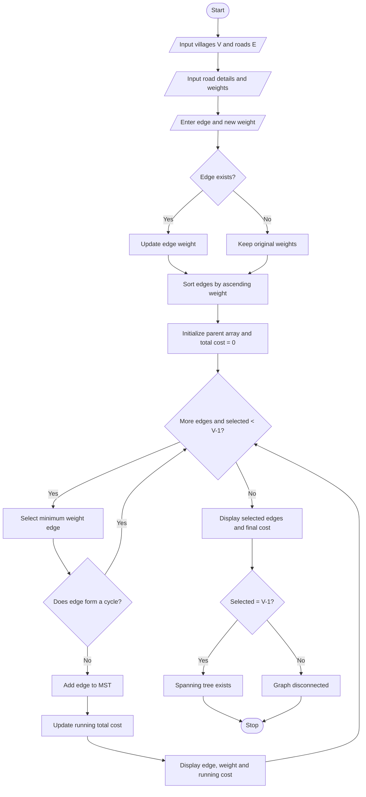

# Flowchart: Modified Kruskal's Algorithm

```mermaid
flowchart TD
    A([Start]) --> B[/Input villages V and roads E/]
    B --> C[/Input road details and weights/]
    C --> D[/Enter edge and new weight/]
    D --> E{Edge exists?}
    E -- Yes --> F[Update edge weight]
    E -- No --> G[Keep original weights]
    F --> H[Sort edges by ascending weight]
    G --> H
    H --> I[Initialize parent array and total cost = 0]
    I --> J{More edges and selected < V-1?}
    J -- Yes --> K[Select minimum weight edge]
    K --> L{Does edge form a cycle?}
    L -- Yes --> J
    L -- No --> M[Add edge to MST]
    M --> N[Update running total cost]
    N --> O[Display edge, weight and running cost]
    O --> J
    J -- No --> P[Display selected edges and final cost]
    P --> Q{Selected = V-1?}
    Q -- Yes --> R[Spanning tree exists]
    Q -- No --> S[Graph disconnected]
    R --> T([Stop])
    S --> T
```
