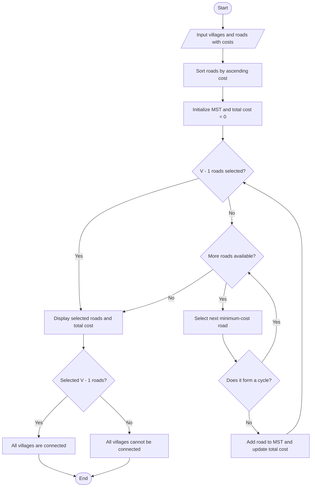

# Flowchart - Kruskal's Algorithm

```mermaid
flowchart TD
    A([Start]) --> B[/Input villages and roads with costs/]
    B --> C[Sort roads by ascending cost]
    C --> D[Initialize MST and total cost = 0]
    D --> E{V - 1 roads selected?}
    E -- Yes --> I[Display selected roads and total cost]
    E -- No --> F{More roads available?}
    F -- No --> I
    F -- Yes --> G[Select next minimum-cost road]
    G --> H{Does it form a cycle?}
    H -- Yes --> F
    H -- No --> J[Add road to MST and update total cost]
    J --> E
    I --> K{Selected V - 1 roads?}
    K -- Yes --> L[All villages are connected]
    K -- No --> M[All villages cannot be connected]
    L --> N([End])
    M --> N
```
