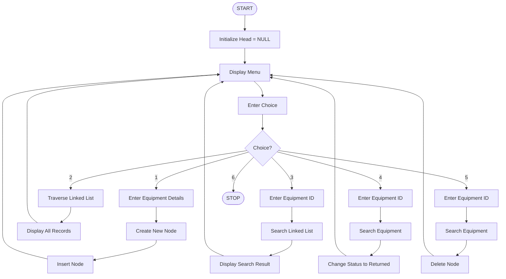

# Lab Equipment Return Tracker

## Title

**Lab Equipment Return Tracker Using Singly Linked List**

---

## Problem Statement

Implement a singly linked list to maintain records of laboratory equipment issued to students. Each node stores the equipment ID, student ID, issue time, and return status. The system should allow the user to add, display, search, update the return status, and delete equipment records efficiently.

---

## Objective

- To develop a singly linked list-based system for managing laboratory equipment records.
- To maintain details of equipment issued to different students.
- To perform insertion, deletion, searching, and updating operations.
- To track whether each equipment item is issued or returned.
- To provide an easy method for locating equipment using its equipment ID.
- To understand the practical use of pointers and dynamic memory allocation.
- To apply linked-list concepts to a real-world laboratory management problem.

---

## Algorithm

1. Start the program.
2. Initialize the linked list with `head = NULL`.
3. Display the following menu:
   - Add Equipment
   - Display Equipment
   - Search Equipment
   - Update Return Status
   - Delete Equipment
   - Exit
4. If **Add Equipment** is selected:
   - Create a new node.
   - Enter Equipment ID, Student ID, and Issue Time.
   - Set the status as **Issued**.
   - Insert the node at the end of the linked list.
5. If **Display Equipment** is selected:
   - Traverse the linked list from `head` to `NULL`.
   - Display all equipment records.
6. If **Search Equipment** is selected:
   - Enter the Equipment ID.
   - Traverse the linked list.
   - If the ID matches, display the equipment details.
   - Otherwise, display "Equipment not found".
7. If **Update Return Status** is selected:
   - Enter the Equipment ID.
   - Search for the corresponding node.
   - Change its status to **Returned**.
8. If **Delete Equipment** is selected:
   - Enter the Equipment ID.
   - Search for the corresponding node.
   - Remove the node from the linked list.
   - Release the allocated memory.
9. Repeat the menu operations until the user selects **Exit**.
10. Stop the program.

---

## Flowchart



---

## Program

### C++ Implementation

```cpp
#include <iostream>
#include <string>
using namespace std;

struct Node {
    int equipmentID;
    int studentID;
    string issueTime;
    string status;
    Node* next;
};

Node* head = NULL;

// Add equipment record
void addEquipment() {
    Node* newNode = new Node;

    cout << "\nEnter Equipment ID: ";
    cin >> newNode->equipmentID;

    cout << "Enter Student ID: ";
    cin >> newNode->studentID;

    cout << "Enter Issue Time: ";
    cin >> newNode->issueTime;

    newNode->status = "Issued";
    newNode->next = NULL;

    if (head == NULL) {
        head = newNode;
    } else {
        Node* temp = head;

        while (temp->next != NULL)
            temp = temp->next;

        temp->next = newNode;
    }

    cout << "Equipment record added successfully.\n";
}

// Display all records
void displayEquipment() {
    if (head == NULL) {
        cout << "\nNo equipment records found.\n";
        return;
    }

    Node* temp = head;

    cout << "\n--- Equipment Records ---\n";

    while (temp != NULL) {
        cout << "Equipment ID : " << temp->equipmentID << endl;
        cout << "Student ID   : " << temp->studentID << endl;
        cout << "Issue Time   : " << temp->issueTime << endl;
        cout << "Status       : " << temp->status << endl;
        cout << "-------------------------\n";

        temp = temp->next;
    }
}

// Search equipment
void searchEquipment() {
    int id;

    cout << "\nEnter Equipment ID to search: ";
    cin >> id;

    Node* temp = head;

    while (temp != NULL) {
        if (temp->equipmentID == id) {
            cout << "\nEquipment Found!\n";
            cout << "Equipment ID : " << temp->equipmentID << endl;
            cout << "Student ID   : " << temp->studentID << endl;
            cout << "Issue Time   : " << temp->issueTime << endl;
            cout << "Status       : " << temp->status << endl;
            return;
        }

        temp = temp->next;
    }

    cout << "Equipment not found.\n";
}

// Update return status
void updateStatus() {
    int id;

    cout << "\nEnter Equipment ID: ";
    cin >> id;

    Node* temp = head;

    while (temp != NULL) {
        if (temp->equipmentID == id) {
            temp->status = "Returned";
            cout << "Equipment status updated to Returned.\n";
            return;
        }

        temp = temp->next;
    }

    cout << "Equipment not found.\n";
}

// Delete equipment record
void deleteEquipment() {
    int id;

    cout << "\nEnter Equipment ID to delete: ";
    cin >> id;

    Node* temp = head;
    Node* previous = NULL;

    while (temp != NULL && temp->equipmentID != id) {
        previous = temp;
        temp = temp->next;
    }

    if (temp == NULL) {
        cout << "Equipment not found.\n";
        return;
    }

    if (previous == NULL)
        head = temp->next;
    else
        previous->next = temp->next;

    delete temp;

    cout << "Equipment record deleted successfully.\n";
}

int main() {
    int choice;

    do {
        cout << "\n===== LAB EQUIPMENT RETURN TRACKER =====\n";
        cout << "1. Add Equipment\n";
        cout << "2. Display Equipment\n";
        cout << "3. Search Equipment\n";
        cout << "4. Update Return Status\n";
        cout << "5. Delete Equipment\n";
        cout << "6. Exit\n";

        cout << "Enter your choice: ";
        cin >> choice;

        switch (choice) {
            case 1:
                addEquipment();
                break;

            case 2:
                displayEquipment();
                break;

            case 3:
                searchEquipment();
                break;

            case 4:
                updateStatus();
                break;

            case 5:
                deleteEquipment();
                break;

            case 6:
                cout << "\nProgram terminated successfully.\n";
                break;

            default:
                cout << "\nInvalid choice! Try again.\n";
        }

    } while (choice != 6);

    return 0;
}
```

---

## Sample Output

### 1. Add Equipment

```text
===== LAB EQUIPMENT RETURN TRACKER =====
1. Add Equipment
2. Display Equipment
3. Search Equipment
4. Update Return Status
5. Delete Equipment
6. Exit

Enter your choice: 1

Enter Equipment ID: 101
Enter Student ID: 205
Enter Issue Time: 10AM

Equipment record added successfully.
```

### 2. Add Another Equipment

```text
Enter your choice: 1

Enter Equipment ID: 102
Enter Student ID: 218
Enter Issue Time: 11AM

Equipment record added successfully.
```

### 3. Display Equipment

```text
Enter your choice: 2

--- Equipment Records ---

Equipment ID : 101
Student ID   : 205
Issue Time   : 10AM
Status       : Issued
-------------------------

Equipment ID : 102
Student ID   : 218
Issue Time   : 11AM
Status       : Issued
-------------------------
```

### 4. Update Return Status

```text
Enter your choice: 4

Enter Equipment ID: 101

Equipment status updated to Returned.
```

### 5. Search Equipment

```text
Enter your choice: 3

Enter Equipment ID to search: 101

Equipment Found!

Equipment ID : 101
Student ID   : 205
Issue Time   : 10AM
Status       : Returned
```

### 6. Delete Equipment

```text
Enter your choice: 5

Enter Equipment ID to delete: 101

Equipment record deleted successfully.
```

### 7. Exit

```text
Enter your choice: 6

Program terminated successfully.
```

---

## Data Structure Used

**Singly Linked List**

Each node contains:

- Equipment ID
- Student ID
- Issue Time
- Return Status
- Pointer to the next node

---

## Operations Performed

| Operation | Description |
|---|---|
| Insertion | Adds a new equipment record |
| Traversal | Displays all equipment records |
| Searching | Finds equipment using Equipment ID |
| Updating | Changes status to Returned |
| Deletion | Removes an equipment record |

---

## Time Complexity

| Operation | Time Complexity |
|---|---|
| Insertion at End | O(n) |
| Display | O(n) |
| Search | O(n) |
| Update | O(n) |
| Deletion | O(n) |

---

## Conclusion

The **Lab Equipment Return Tracker** was successfully implemented using a **singly linked list** in C++. The project demonstrates the practical application of linked lists for managing dynamic laboratory equipment records.

The system successfully performs insertion, traversal, searching, updating, and deletion operations. It also provides practical understanding of pointers, nodes, dynamic memory allocation, and linked-list traversal.

Overall, this project demonstrates how a singly linked list can be effectively used to manage records that are frequently added, modified, searched, and removed.

---

## Project Structure

```text
Lab-Equipment-Return-Tracker/
│
├── Algorithm/
│   └── README.md
│
├── Output/
│   └── README.md
│
├── Src/
│   └── main.cpp
│
├── flowchart/
│   └── README.md
│
└── README.md
```

---

##  Technologies Used

- **Programming Language:** C++
- **Data Structure:** Singly Linked List
- **IDE:** Any C++ compatible IDE
- **Version Control:** GitHub
