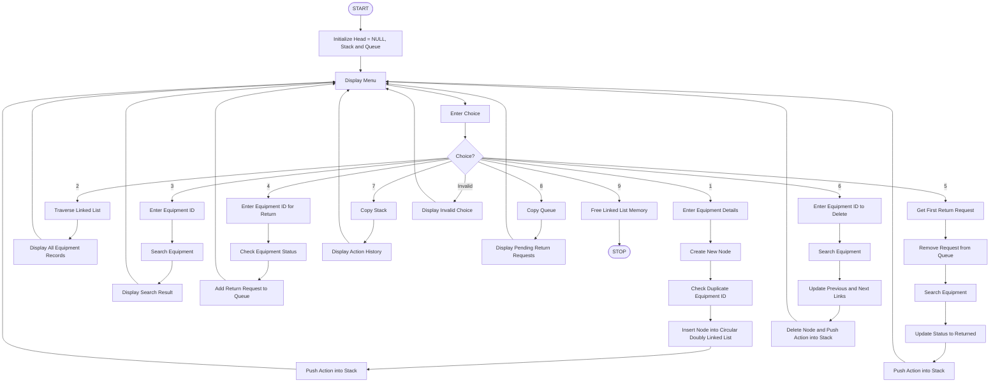

# Flowchart – Lab Equipment Return Tracker

```mermaid
flowchart TD
    A([START]) --> B[Initialize Head = NULL, Stack and Queue]
    B --> C[Display Menu]
    C --> D[Enter Choice]
    D --> E{Choice?}

    E -->|1| F[Enter Equipment Details]
    F --> G[Create New Node]
    G --> H[Check Duplicate Equipment ID]
    H --> I[Insert Node into Circular Doubly Linked List]
    I --> J[Push Action into Stack]
    J --> C

    E -->|2| K[Traverse Linked List]
    K --> L[Display All Equipment Records]
    L --> C

    E -->|3| M[Enter Equipment ID]
    M --> N[Search Equipment]
    N --> O[Display Search Result]
    O --> C

    E -->|4| P[Enter Equipment ID for Return]
    P --> Q[Check Equipment Status]
    Q --> R[Add Return Request to Queue]
    R --> C

    E -->|5| S[Get First Return Request]
    S --> T[Remove Request from Queue]
    T --> U[Search Equipment]
    U --> V[Update Status to Returned]
    V --> W[Push Action into Stack]
    W --> C

    E -->|6| X[Enter Equipment ID to Delete]
    X --> Y[Search Equipment]
    Y --> Z[Update Previous and Next Links]
    Z --> AA[Delete Node and Push Action into Stack]
    AA --> C

    E -->|7| AB[Copy Stack]
    AB --> AC[Display Action History]
    AC --> C

    E -->|8| AD[Copy Queue]
    AD --> AE[Display Pending Return Requests]
    AE --> C

    E -->|9| AF[Free Linked List Memory]
    AF --> AG([STOP])

    E -->|Invalid| AH[Display Invalid Choice]
    AH --> C
```
