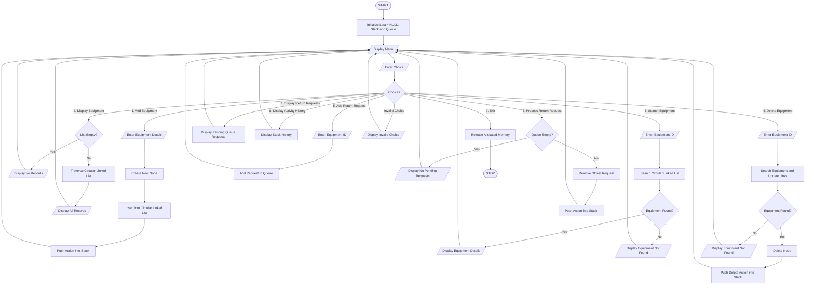

# Flowchart – Lab Equipment Return Tracker Using Circular Linked List, Stack, and Queue

```mermaid
flowchart TD
    A([START]) --> B[Initialize Last = NULL, Stack and Queue]
    B --> C[/Display Menu/]
    C --> D[/Enter Choice/]
    D --> E{Choice?}

    E -->|1. Add Equipment| F[/Enter Equipment Details/]
    F --> G[Create New Node]
    G --> H[Insert into Circular Linked List]
    H --> I[Push Action into Stack]
    I --> C

    E -->|2. Display Equipment| J{List Empty?}
    J -->|Yes| K[/Display No Records/]
    J -->|No| L[Traverse Circular Linked List]
    L --> M[/Display All Records/]
    K --> C
    M --> C

    E -->|3. Search Equipment| N[/Enter Equipment ID/]
    N --> O[Search Circular Linked List]
    O --> P{Equipment Found?}
    P -->|Yes| Q[/Display Equipment Details/]
    P -->|No| R[/Display Equipment Not Found/]
    Q --> C
    R --> C

    E -->|4. Delete Equipment| S[/Enter Equipment ID/]
    S --> T[Search Equipment and Update Links]
    T --> U{Equipment Found?}
    U -->|Yes| V[Delete Node]
    V --> W[Push Delete Action into Stack]
    W --> C
    U -->|No| X[/Display Equipment Not Found/]
    X --> C

    E -->|5. Add Return Request| Y[/Enter Equipment ID/]
    Y --> Z[Add Request to Queue]
    Z --> C

    E -->|6. Process Return Request| AA{Queue Empty?}
    AA -->|Yes| AB[/Display No Pending Requests/]
    AA -->|No| AC[Remove Oldest Request]
    AC --> AD[Push Action into Stack]
    AD --> C
    AB --> C

    E -->|7. Display Return Requests| AE[Display Pending Queue Requests]
    AE --> C

    E -->|8. Display Activity History| AF[Display Stack History]
    AF --> C

    E -->|9. Exit| AG[Release Allocated Memory]
    AG --> AH([STOP])

    E -->|Invalid Choice| AI[/Display Invalid Choice/]
    AI --> C
```

