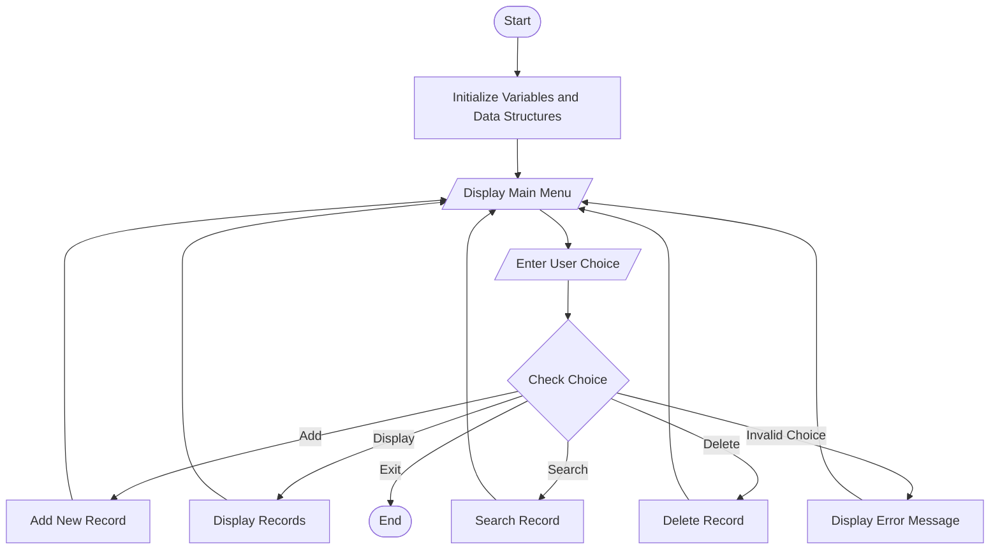

# Flowchart

```mermaid
flowchart TD
    A([Start]) --> B[Initialize Variables and Data Structures]
    B --> C[/Display Main Menu/]
    C --> D[/Enter User Choice/]
    D --> E{Check Choice}

    E -->|Add| F[Add New Record]
    E -->|Display| G[Display Records]
    E -->|Search| H[Search Record]
    E -->|Delete| I[Delete Record]
    E -->|Exit| J([End])
    E -->|Invalid Choice| K[Display Error Message]

    F --> C
    G --> C
    H --> C
    I --> C
    K --> C
```
