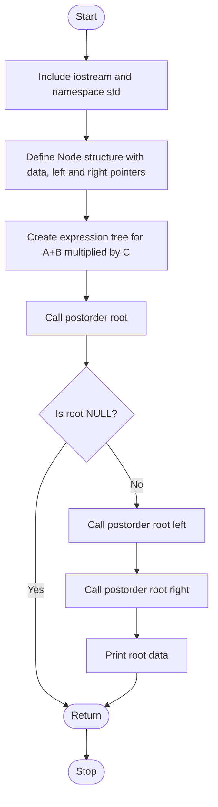

## Flowchart

```mermaid
flowchart TD
    A([Start]) --> B[Include iostream and namespace std]
    B --> C[Define Node structure with data, left and right pointers]
    C --> D[Create expression tree for A+B multiplied by C]
    D --> E[Call postorder root]
    E --> F{Is root NULL?}
    F -- Yes --> G([Return])
    F -- No --> H[Call postorder root left]
    H --> I[Call postorder root right]
    I --> J[Print root data]
    J --> G
    G --> K([Stop])
```
