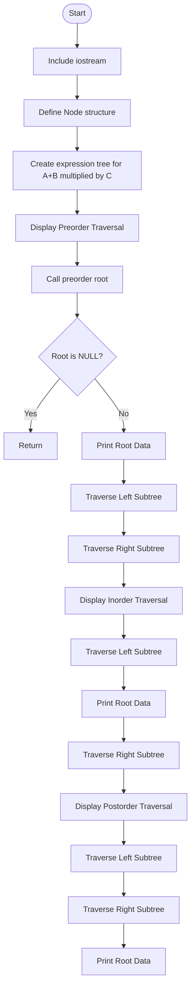

```mermaid
flowchart TD
    A([Start]) --> B[Include iostream]
    B --> C[Define Node structure]
    C --> D[Create expression tree for A+B multiplied by C]
    D --> E[Display Preorder Traversal]
    E --> F[Call preorder root]
    F --> G{Root is NULL?}
    G -- Yes --> H[Return]
    G -- No --> I[Print Root Data]
    I --> J[Traverse Left Subtree]
    J --> K[Traverse Right Subtree]
    K --> L[Display Inorder Traversal]
    L --> M[Traverse Left Subtree]
    M --> N[Print Root Data]
    N --> O[Traverse Right Subtree]
    O --> P[Display Postorder Traversal]
    P --> Q[Traverse Left Subtree]
    Q --> R[Traverse Right Subtree]
    R --> S[Print Root Data]
```
    S --> T[Delete Tree and Free Memory]
    T --> U([Stop])
```
