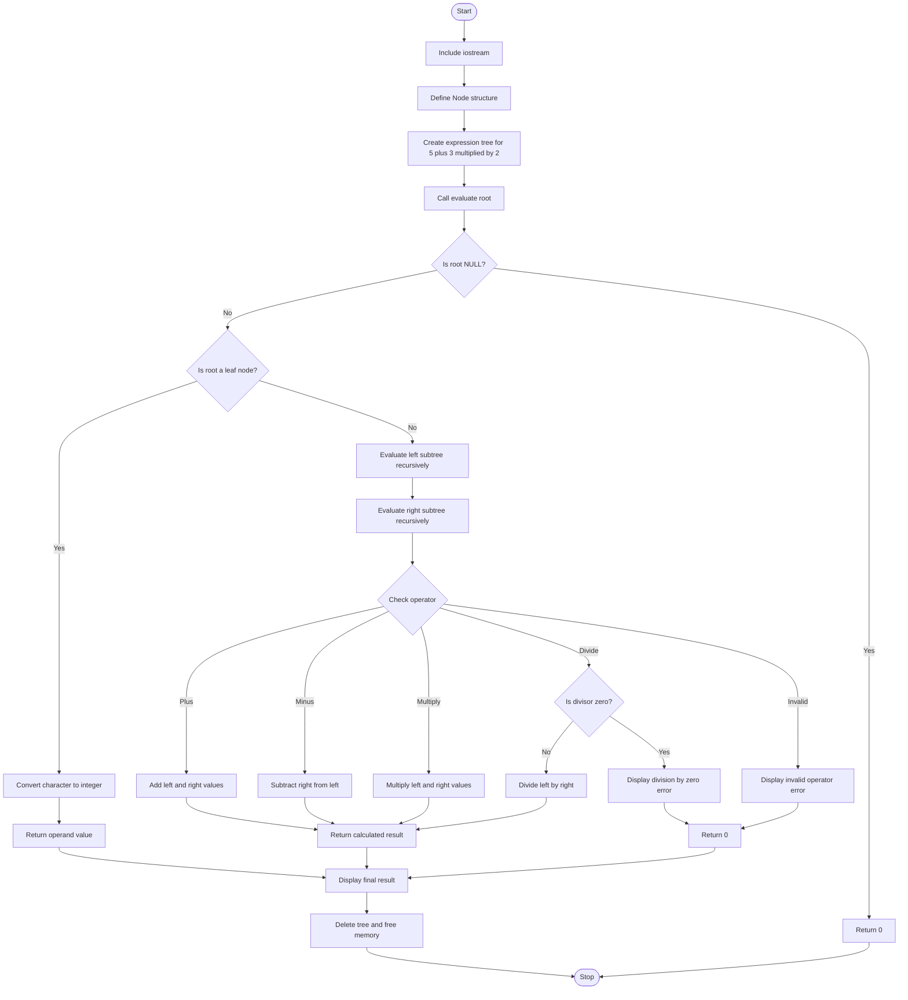

```mermaid
flowchart TD
    A([Start]) --> B[Include iostream]
    B --> C[Define Node structure]
    C --> D[Create expression tree for 5 plus 3 multiplied by 2]
    D --> E[Call evaluate root]
    E --> F{Is root NULL?}
    F -- Yes --> G[Return 0]
    F -- No --> H{Is root a leaf node?}
    H -- Yes --> I[Convert character to integer]
    I --> J[Return operand value]
    H -- No --> K[Evaluate left subtree recursively]
    K --> L[Evaluate right subtree recursively]
    L --> M{Check operator}
    M -- Plus --> N[Add left and right values]
    M -- Minus --> O[Subtract right from left]
    M -- Multiply --> P[Multiply left and right values]
    M -- Divide --> Q{Is divisor zero?}
    Q -- Yes --> R[Display division by zero error]
    R --> S[Return 0]
    Q -- No --> T[Divide left by right]
    M -- Invalid --> U[Display invalid operator error]
    U --> S
    N --> V[Return calculated result]
    O --> V
    P --> V
    T --> V
    J --> W[Display final result]
    V --> W
    S --> W
    W --> X[Delete tree and free memory]
    X --> Y([Stop])
    G --> Y
```
